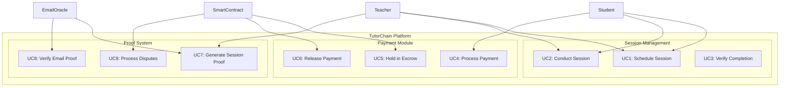
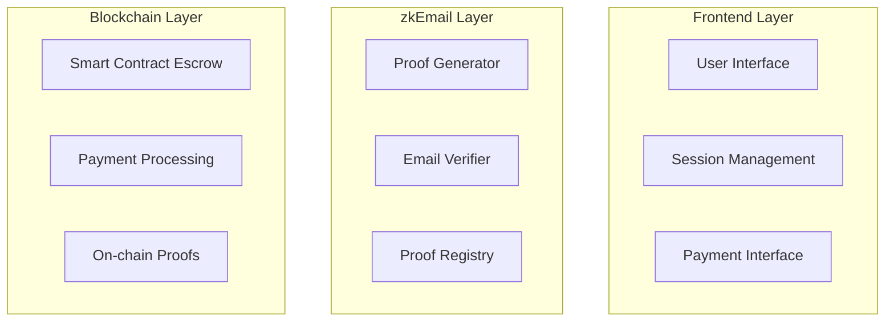

# TutorChain: Decentralized Tutoring Platform with zkEmail Integration

## Actor Analysis

### Primary Actors

- **Teacher**: Professionals offering educational services
- **Student**: Users seeking educational services
- **Platform Admin**: Manages platform operations
- **Smart Contract**: Handles automated escrow and payments
- **Email Oracle**: Processes and verifies email-based proofs

### Secondary Actors

- **Payment Processor**: Handles cryptocurrency transactions
- **Meeting Platform**: Provides video conferencing services
- **Email Service Provider**: Sends verification and confirmation emails

## Use Case Diagrams



## User Stories

### Teacher Stories

```markdown
As a teacher, I want to:

- Create a profile showcasing my expertise and availability
- Receive secure payments through email confirmation
- Generate proofs of completed sessions
- Maintain a verifiable reputation on-chain
- Handle disputes through email-based verification
```

### Student Stories

```markdown
As a student, I want to:

- Browse and book sessions with qualified teachers
- Pay securely with funds held in escrow
- Verify session completion through email
- Provide feedback that can be verified on-chain
- Dispute unsatisfactory sessions with proof
```

### Platform Stories

```markdown
As a platform, we need to:

- Verify email proofs for session completion
- Manage escrow payments automatically
- Generate immutable session records
- Handle dispute resolution transparently
- Maintain privacy while ensuring verification
```

## Core Features

### 1. Session Management

**Status:** In Progress

- Scheduling system
- Video conferencing integration
- Session tracking
- Attendance verification

### 2. zkEmail Integration

**Status:** Active Development

```markdown
Key Components:

- Attendance proof generation
- Quality assessment verification
- Payment release confirmation
- Dispute resolution proof
```

### 3. Smart Contract Escrow

**Status:** Active Development

```markdown
Features:

- Multi-sig email control
- Automated payment release
- Dispute handling
- Proof verification
```

## Technical Architecture

### Component Diagram



## Development Phases

### Phase 1: Core Infrastructure

- Basic user management
- Session scheduling
- zkEmail proof generation setup

### Phase 2: Payment Integration

- Escrow contract deployment
- Email-based payment release
- Basic dispute handling

### Phase 3: Advanced Features

- Reputation system
- Advanced dispute resolution
- Analytics and reporting

## Success Metrics

### User Engagement

- Session completion rate
- User retention
- Dispute frequency

### Technical Performance

- Proof generation success rate
- Payment processing time
- System uptime

### Business Metrics

- Transaction volume
- User growth
- Platform revenue

## Risk Assessment

### Technical Risks

- Email proof reliability
- Smart contract security
- Scalability challenges

### Business Risks

- User adoption
- Regulatory compliance
- Market competition

## Future Enhancements

### Planned Features

- AI-powered matching
- Advanced analytics
- Mobile application
- Integration with educational platforms
